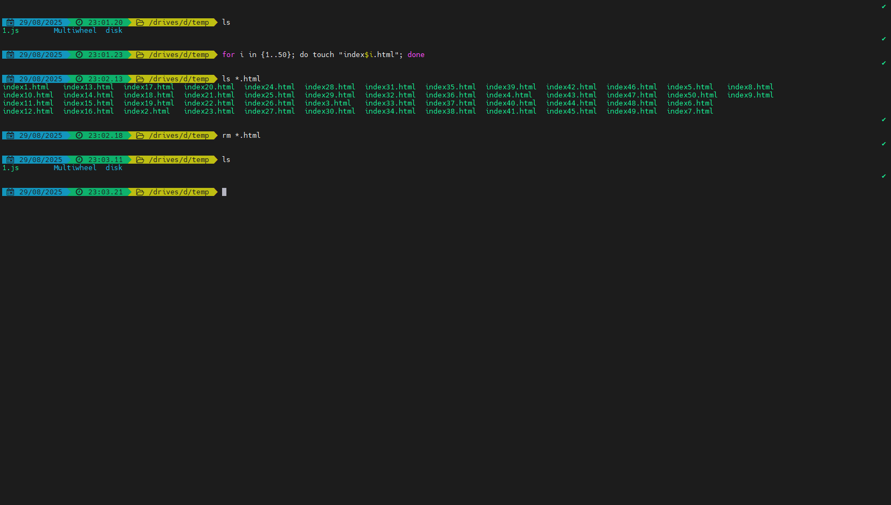

# udemy-nodejs

> 这个项目旨在学习node.js为主，也是我为了了解更多node.js才去学的

## start

1. 环境🕹️

   Liunx/mac/windows

   VScode

   Node.js/nvm

   wireshark

   postman或者apifox

   chorme或者edge

   > 我用的是windows11，terminal不如mac/Liunx好用，可以下载一个[MobaXterm](https://mobaxterm.mobatek.net/download.html)(免费版即可)，可以在window系统中使用Liunx的命令，不习惯英文的话，可以用中文包来汉化下 => [MobaXterm-Chinese-Simplified](https://github.com/RipplePiam/MobaXterm-Chinese-Simplified)(开源项目，自己看文档搞定)
   >
   > 示例一下在windows中使用liunx的命令：
   >
   > 

2. 