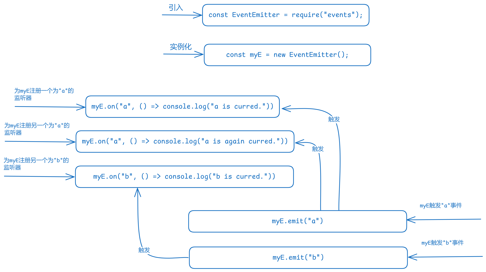

# udemy-nodejs

> 这个项目旨在学习node.js为主，那为什么学习Node.js？🧐
>
> 1. 了解JavaScript的全部
> 2. 了解前后端all的工作流程，包括计算机基本的知识
> 3. 扩宽自己的视野，去做更多的事情，比如：I/O输入输出，如果你只是一名前端，你是没有机会去了解这些东西的
> 4. 成为更全面的前端人才，所以必须熟悉服务端，全栈
>
> 它不是什么？
>
> 这不是为了成为全栈而学习的！因为它本来就不是我为了去竞争全栈工作而学习的

## resource

1. [Udeerstanding Node.js:Core Concepts](https://www.udemy.com/course/understanding-nodejs-core-concepts/)

## start

1. 环境🕹️

   Liunx/mac/windows

   VScode

   Node.js/volta

   wireshark

   postman或者apifox

   chorme或者edge

   > 我用的是windows11，terminal不如mac/Liunx好用，可以下载一个[MobaXterm](https://mobaxterm.mobatek.net/download.html)(免费版即可)，可以在window系统中使用Liunx的命令，不习惯英文的话，可以用中文包来汉化下 => [MobaXterm-Chinese-Simplified](https://github.com/RipplePiam/MobaXterm-Chinese-Simplified)(开源项目，自己看文档搞定)
   >
   > 示例一下在windows中使用liunx的命令：
   >
   > 

   * 使用

     由于volta可以无缝处理不同项目中的不同工具版本，所以进入项目时，node.js和pnpm以及切换成指定版本

     安装依赖
     
     ```shell
     pnpm i

## chapter

课程每章的章节的代码内容在`/course`文件夹中。

下面基本介绍每章章节内容：

### 01-Introduction

这章的内容，主要是安装基本的开发环境（上面已经提到）以及Node.js的介绍

介绍包含：计算机到Node.js的发展（简要，Node.js是2009年发布的），v8引擎，Node.js是什么？（运行时），Node.js的组成部分（代码角度），Node.js事件循环等

### 02-EventEmitter

Node.js中的`events`模块，用于**事件驱动编程**，主要围绕着一个核心类：`EventEmitter`（事件发射器），你可以把它想象成一个可以监听特定“事件”并在这些事件发生时执行代码的对象。

- **事件 (Event)：** 是程序中发生的可被识别的某个动作或状态的信号。例如，用户点击按钮、服务器收到请求、文件读取完成、定时器触发等。
- **事件发射器 (EventEmitter)：** 一个可以**触发**（emit）事件的对象，并且可以**注册**（on）事件监听器（事件处理函数）。Node.js 的许多核心模块（如 `http`、`fs`、`net`、`stream`）都内置了 `EventEmitter`，也就是说它们都是“事件发射器”。



还包含使用`JavaScript`手写`EventEmitter`这部分。

### 03-Buffers

#### 二进制/八进制/十进制/十六进制

数制是一种表示数值的方法，每种数制都有其基数（即该数制中使用的数字个数）。

- **二进制（Binary）**：基数为2，使用0和1两个数字。由于计算机内部使用电位高低来表示信息，因此二进制非常适合用于计算机系统。
- **八进制（Octal）**：基数为8，使用0到7八个数字。在早期的计算机系统中较为常用，但现在较少直接使用。
- **十进制（Decimal）**：基数为10，使用0到9十个数字。这是人类日常生活中最常用的数制。
- **十六进制（Hexadecimal）**：基数为16，使用0到9以及A到F共十六个符号。广泛应用于计算机科学领域，特别是在表示内存地址、颜色编码等方面。

在`JavaScript`中表示：

```javascript
let a = 0b10 0011 0100 // 二进制 1 * 2**9 + 0 * 2**8 + 0 * 2**7 + 0 * 2**6 + 1 * 2**5 + 1 * 2**4 + 0 * 2**3 + 1 * 2**2 + 0 * 2**1 + 0 * 2**0 = 654
let b = 0o1064 // 八进制 1 * 8**3 + 0 * 8**2 + 6 * 8**1 + 4 * 8**0 = 654
let c = 564 // 十进制 5 * 10**2 + 6 * 10**1 + 4 * 10**0 = 654
let d = 0x234 // 十六进制 2 * 16**2 + 3 * 16**1 + 4 * 16**0 = 564
```

在计算器中表示:


#### 字符集

1. Unicode和ASCII

   Unicode是一个**字符集**和**字符编码标准**（主要是字符集），旨在为世界上**所有**语言中的**所有**字符提供一个**统一的、独一无二的编码**。可以通过 https://home.unicode.org/ 来查看Unicode最新的情况。截至2025年09月07日，Unicode的版本为 16.0.0,总共包含了 154998 个字符。

   ASCII也是一个字符集，目前只有128个，是固定的，可以描述英语中所有的字符。ASCII对照表可以通过https://www.ascii-code.com/ 来查看。

   <u>其中ASCII是Unicode编码集的一个很小的子集。</u>

2. 以及什么是编码和解码？

   **编码**：通常是指将原始数据（比如字符、图像、声音）按照某种规则转换成计算机（或通信）系统能够存储、传输或处理的格式。这个格式通常是**二进制数据**或**字节序列**。编码规则比如：`hex` `utf-8` `gbk` `base64`等。

   **解码**：通常是指将经过编码的复杂数据（如字节序列、网络数据包、压缩文件、加密数据）按照**相同的规则**还原成原始的、可理解的数据（如文本、图像、声音）

Unicode是字符定义的标准，每个字符都有一个“唯一的编号”，编码是计算机将这个“唯一的编号”翻译成二进制的方式。

#### Buffer

Buffer 也叫做**缓冲区**，根据Node.js的官方解释：**Buffer对象表示固定长度的字节序列。**其存储的是**原始字节数据**（0-255 的整数），这些字节可以用不同的**编码方式**来解读和表示：

```javascript
// 在 Node.js 中，Buffer全局可用
var buff_0 = Buffer.alloc(8); // 分配8个位置
buff_0[0] = 0x48;
buff_0[1] = 0x69;
buff_0[2] = 0x21;
console.log(buff_0.toString("utf-8")); // 以 utf-8编码 的方式输出字符串
```

下面介绍几个重要的API：

* Buffer 初始化
  * Buffer.alloc：分配一个大小为字节的新缓冲区。如果填充未定义，则缓冲区将填充为零。
  * Buffer.from：使用0-255范围内的字节数组分配新的缓冲区。超出该范围的数组条目将被截断以适应它
  * Buffer.allocUnsafe：分配一个大小为字节的新缓冲区。如果大小大于buffer.constants.MAX_LENGTH或小于0，抛出ERR_OUT_OF_RANGE异常；以这种方式创建的Buffer实例的缓冲区的内容来源于内存池，内容未知，可能包含敏感数据。
  * Buffer.allocUnsafeSlow：类似于 Buffer.allocUnsafe，但是总是会独立分配,不使用内存池 (也就是大于 Buffer.poolSize 则优先使用),所以速度上比 Buffer.allocUnsafe 慢，且该 Buffer 会长期存在

* buff.toString：根据编码中指定的字符编码将buf解码为字符串。

* buffer.constants.MAX_LENGTH：单个Buffer实例允许的最大大小。

* buff.fill: 填充buffer

* Buffer.poolSize：这是用于内存池的预分配内部Buffer实例的大小（以字节为单位）。此值可以修改。

* Buffer 读写能力

  * buff.write

  * buff.read

    ....

其中 `Buffer.` 代表Buffer对象的静态方法，`buff.` 代表Buffer对象的方法，`buffer.`代表buffer的其他API。

更多API请参考：[Buffer](https://nodejs.org/docs/latest/api/buffer.html)；更多代码请参考示例：./course/03-Buffers

